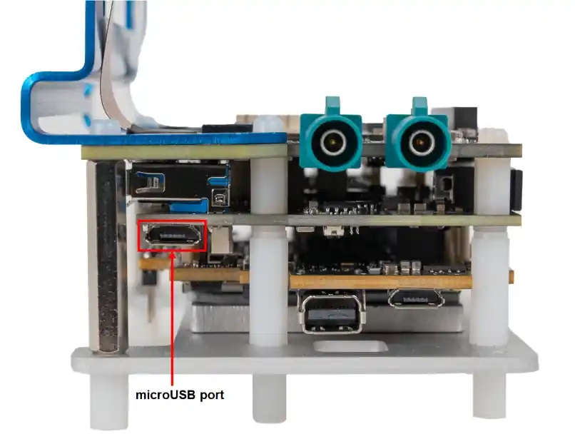
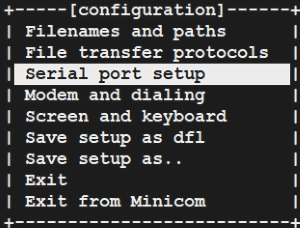
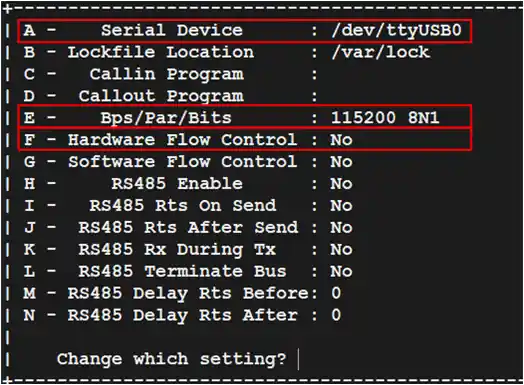
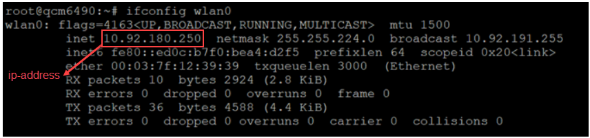
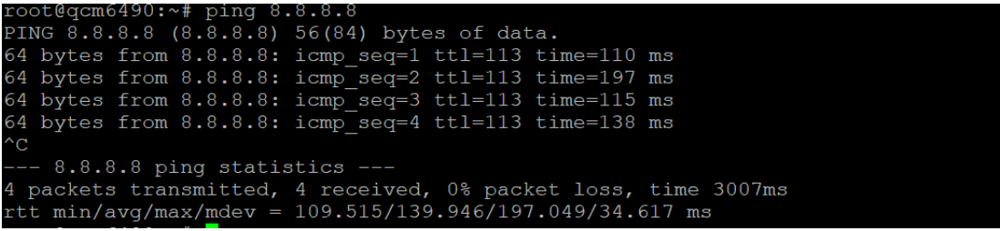

.. _howto_setup:

Setup
=====

.. _section_ags_ssh_p1c_vinayjk_03-01-24-1109-49-684:

How to connect to a UART shell?
-------------------------------

To set up the debug UART connection and view diagnostic messages,
connect the micro-USB cable from the micro-USB port on the RB3 Gen 2
device to the Linux host.

|image1|

1. Install Minicom on the Linux host:

   ::

      sudo apt update
      sudo apt install minicom

2. Check the USB port:

   ::

      ls /dev/ttyUSB*

   **Sample output**

   ``/dev/ttyUSB0``

3. Open Minicom:

   ::

      sudo minicom -s

4. Press the Down arrow key to select the **Serial port setup** option.
   Use the Up and Down arrow keys to navigate through the menu.

   |image2|

5. Set up the serial device configuration:

   1. Press **A** on your keyboard to set up the serial device name such
      as ``/dev/ttyUSB0``.

   2. Press **Enter** to save the changes.

   3. Press **E** on your keyboard to set the baud rate. If the baud
      rate is not set to **115200**, press the **E** key again.

   4. Press **Q** on your keyboard to set the configuration to **8N1**.

   5. Press **Enter** to save the changes.

   6. Press **F** on your keyboard to set the **Hardware Flow Control**
      to ``No``.

      **Note:** Ensure that the letters A, E, Q, and F are in uppercase.

      |image3|

   7. Press **Enter** to save the changes.

6. Select the **Save setup as dfl** option and press **Enter**.

   |image4|

7. Select **Exit** to open the UART console.

8. Log in to the UART console:

   -  Login: ``root``
   -  Password: ``oelinux123`` **Note:** If the login console does not
      display as expected, verify the USB connection. If necessary,
      disconnect and then reconnect the micro-USB.

**Note:** If you want to run sample applications from the UART shell,
ensure to run applications in the Permissive mode:

::

   setenforce 0
   mount -o rw,remount /

.. _section_hmw_vsh_p1c_vinayjk_03-01-24-1110-45-279:

How to SSH?
-----------

**Set up Wi-Fi**

Wi-Fi is operational in Station mode. The Wi-Fi host driver and the
authentication for network management are initialized during the device
boot up.

To update the Wi-Fi configuration, perform the following from the debug
`UART serial
console <#section_ags_ssh_p1c_vinayjk_03-01-24-1109-49-684>`__:

1. Remount and enable read-and-write access to the default read-only
   ``rootfs`` file before editing the ``/etc/wpa_supplicant.conf`` file:

   ::

      setenforce 0
      mount -o rw,remount /

2. Stop the ``wpa_supplicant``:

   ::

      killall wpa_supplicant

3. Modify the content of the default ``wpa_supplicant.conf`` file to
   match the SSID and password of your router and open it using the
   on-device VI editor:

   ::

      vi /etc/wpa_supplicant.conf

   **Note:** You can see the following configurations for security types
   specified in the default ``wpa_supplicant.conf`` file at ``/etc`` to
   add your required router configurations.

   ::

      # Only WPA-PSK is used. Any valid cipher combination is accepted.
      ctrl_interface=/var/run/sockets

      network={
      #Open
      #       ssid="example open network"
      #       key_mgmt=NONE
      #WPA-PSK
      #  Update the SSID to match that of the Wi-Fi SSID of your router. 
      ssid="QSoftAP"
      #       proto=WPA RSN
      #       key_mgmt=WPA-PSK
      #       pairwise=TKIP CCMP
      #       group=TKIP CCMP
      # Update the password to match that of the Wi-Fi password of your router.
      psk="1234567890"
      #WEP
      #       ssid="example wep network"
      #       key_mgmt=NONE
      #       wep_key0="abcde"
      #       wep_key1=0102030405
      #       wep_tx_keyidx=0
      }

4. Save the modified ``wpa_supplicant.conf`` file and verify its
   content:

   ::

      cat /etc/wpa_supplicant.conf

5. Reboot or power cycle the device. Wait for approximately one minute
   to establish a WLAN connection with the updated SSID and password.

6. **(Optional)** If you prefer not to reboot the device, run the
   following commands:

   ::

      wpa_supplicant -Dnl80211 -iwlan0 -ddd -c /etc/wpa_supplicant.conf -f /tmp/wpa_supplicant-log.txt &
      dhcpcd wlan0

7. Check the WLAN connection status and IP address:

   ::

      ifconfig wlan0

   |image5|

8. Ping the router to confirm the connection:

   ::

      ping 8.8.8.8

   |image6|

**Connect to SSH**

**Note:** Ensure that a Wi-Fi connection is established before
connecting to SSH.

1. Find the IP address of the RB3 Gen 2 device in UART console:

   ::

      ifconfig wlan0

2. Use the IP address obtained from **step 1** to SSH the device:

   ::

      ssh root@ip-address

   **Example**

   ``ssh root@10.92.180.250``

3. Connect to the SSH shell using the following password:

   ::

      oelinux123

**Note:** Ensure that the Linux host is connected to the same Wi-Fi
access point.

**Note:** To transfer the files successfully using the ``scp`` command,
use the password ``oelinux123``.

.. _section_j5g_rds_5bc_vinayjk_06-21-24-1739-53-921:

How to configure Ethernet with RJ45 port?
-----------------------------------------

Ethernet/RJ45 port is enabled as a downstream port of PCIe to USB
controller (``renesas``). Ensure that ``renesas_usb_fw.mem`` is
available at the ``/lib/firmware`` directory.

**Note:** If ``renesas_usb_fw.mem`` firmware is not available at the
``/lib/firmware`` directory, then `connect to
UART <#section_ags_ssh_p1c_vinayjk_03-01-24-1109-49-684>`__ and `enable
the Wi-Fi <#set_up_wifi>`__.

After getting SSH and IP address, `update PCIe to USB controller
firmware <#section_nsb_5gs_5bc_vinayjk_06-21-24-1803-34-149>`__.

To check if USB to ETH controller is enumerated, run the following
command:

::

   lsusb

**Sample output**:

::

   Bus 002 Device 003: ID 0b95:1790 ASIX Electronics Corp. AX88179 Gigabit Ethernet
   Bus 002 Device 002: ID 05e3:0625 Genesys Logic, Inc. USB3.2 Hub
   Bus 002 Device 001: ID 1d6b:0003 Linux Foundation 3.0 root hub
   Bus 001 Device 002: ID 05e3:0610 Genesys Logic, Inc. Hub
   Bus 001 Device 001: ID 1d6b:0002 Linux Foundation 2.0 root hub

Connect an RJ45 cable to the RB3 Gen 2 device.

To check the Ethernet IP address, run the following command:

::

   ifconfig

**Sample output**:

**Note:** 10.219.0.106 is the IP address.

::

   enP1p4s0u1u1 Link encap:Ethernet HWaddr A6:CD:9B:FD:C1:B5
             inet addr:10.219.0.106  Bcast:10.219.1.255  Mask:255.255.254.0
             inet6 addr: fe80::a370:7a00:8131:5a03/64 Scope:Link
             UP BROADCAST RUNNING MULTICAST  MTU:1500  Metric:1
             RX packets:1071 errors:0 dropped:0 overruns:0 frame:0
             TX packets:132 errors:0 dropped:0 overruns:0 carrier:0
             collisions:0 txqueuelen:1000
             RX bytes:60711 (59.2 KiB)  TX bytes:18342 (17.9 KiB)

.. _section_nsb_5gs_5bc_vinayjk_06-21-24-1803-34-149:

How to update USB and Ethernet controller firmware?
---------------------------------------------------

If you encounter any USB or Ethernet connectivity issues on the RB3 Gen
2 device, a firmware update for the PCIe to USB controller could be a
solution.

**Prerequisite**: The device should be connected to the SSH terminal.

1. To download the
   `firmware <https://www.renesas.com/us/en/products/interface/usb-switches-hubs/upd720201-usb-30-host-controller>`__,
   you must register and log in with your ID.

2. Transfer the files using SCP to the following path:
   ``/lib/firmware``.

   **Note:** The firmware name should be ``renesas_usb_fw.mem`` and if
   not, you must rename it. The driver identifies the firmware based on
   this specific filename, and other firmware names will not function.

   **Example**:

   ::

      scp renesas_usb.mem root@<ip address>:/lib/firmware

   **Note:** When prompted for a password, enter ``oelinux123``.

**Note:** After flashing the firmware, reboot the device. Upon
subsequent boot-up, the driver reads the firmware and activates the
PCIe-to-USB controller.

.. |image4| image:: ../../media/k2c-qli-build-ga/save_setup_as_dfl.png

