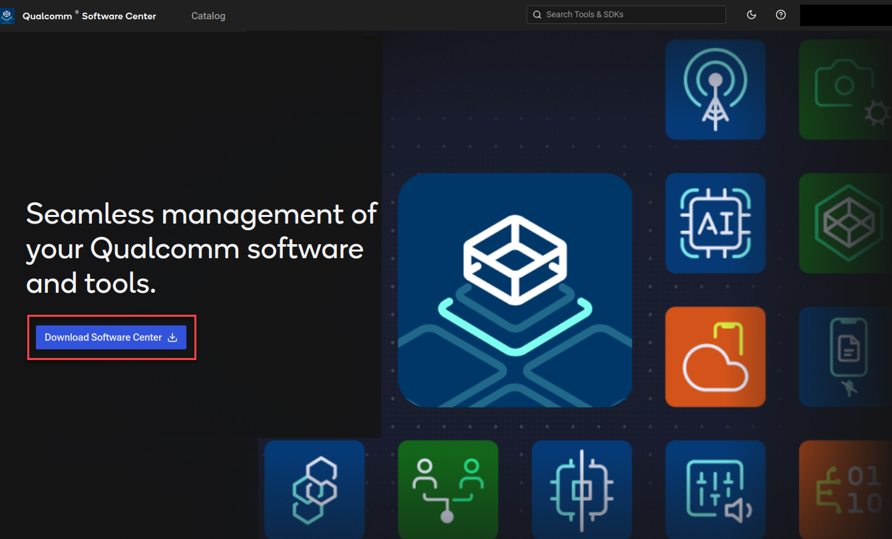

.. _concept_rr1_5dn_w1c:

Install QSC
===========

There are two methods to install QSC:

-  Using a GUI
-  Using a CLI

.. _section_mkf_b2n_w1c:

Install QSC using a GUI
-----------------------

Use the Qualcomm Software Center (QSC) GUI to install QSC.

1. Use your Qualcomm ID to log in to
   https://softwarecenter.qualcomm.com, then click **Download Software
   Center**. The QSC Debian package (``.deb``) downloads to your
   machine.

   |image1|

2. Install the downloaded QSC Debian package:

   ::

      sudo dpkg -i <download_path>/QualcommSoftwareCenterx.x.x.linux-x86.deb
      # <x.x.x> indicates QSC version

.. _section_hrf_d2n_w1c:

Install QSC using a CLI
-----------------------

1. Install curl (if not already installed):

   ::

      sudo apt install curl

2. Download the QSC Debian package:

   ::

      cd <workspace_path>
      curl -L https://softwarecenter.qualcomm.com/api/download/software/qsc/linux/latest.deb -o qsc_installer.deb

3. Install the Debian package:

   ::

      sudo dpkg -i qsc_installer.deb

   After a successful installation, the message
   ``Installed Qualcomm Software Center vx.x.x successfully`` is
   displayed.

