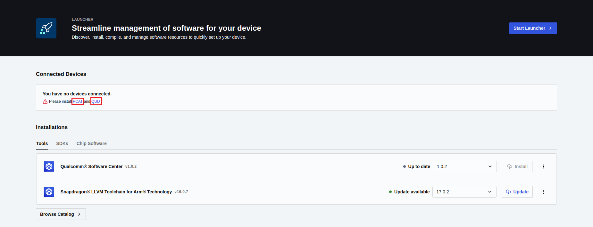
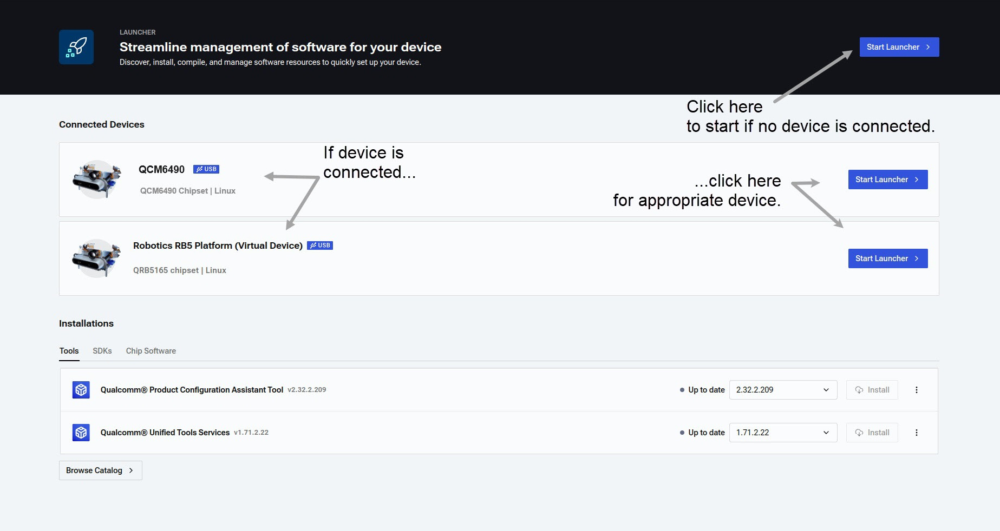
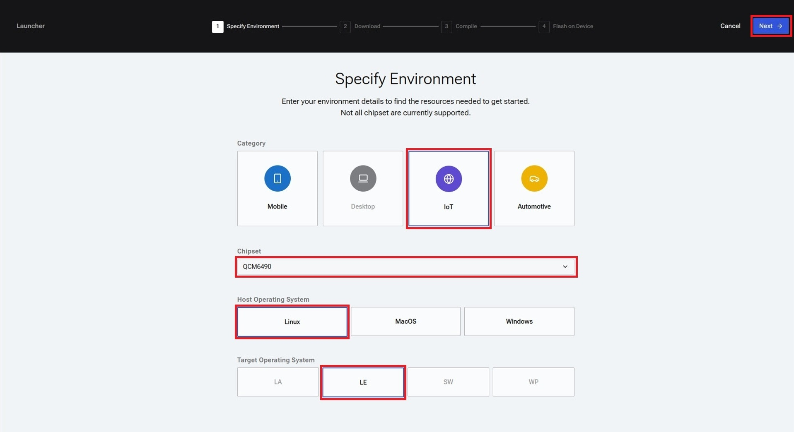
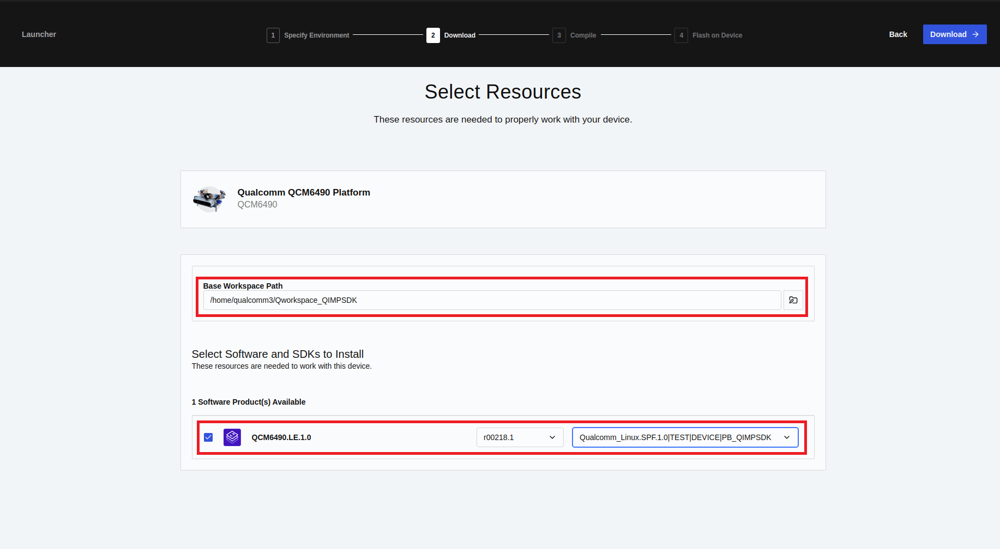
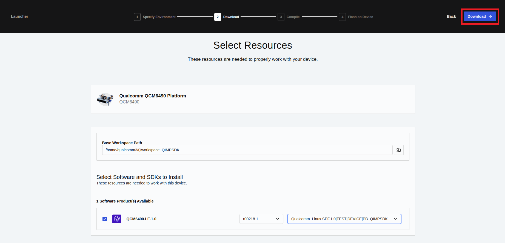
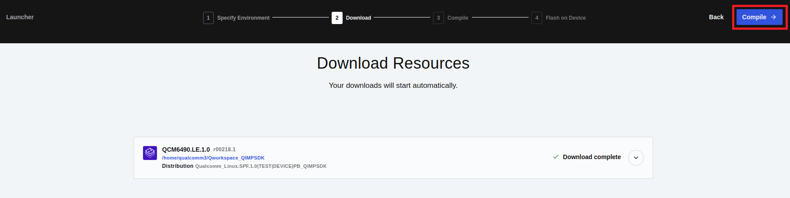
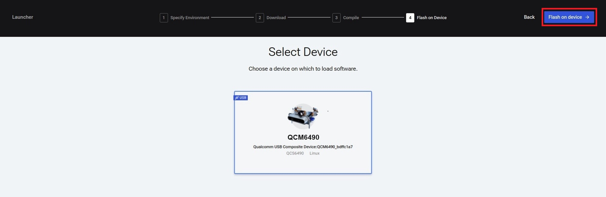
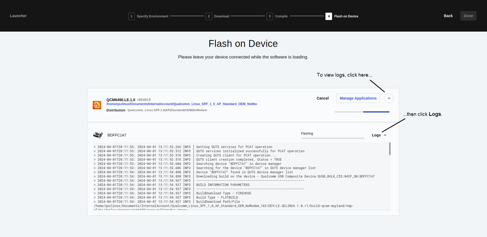
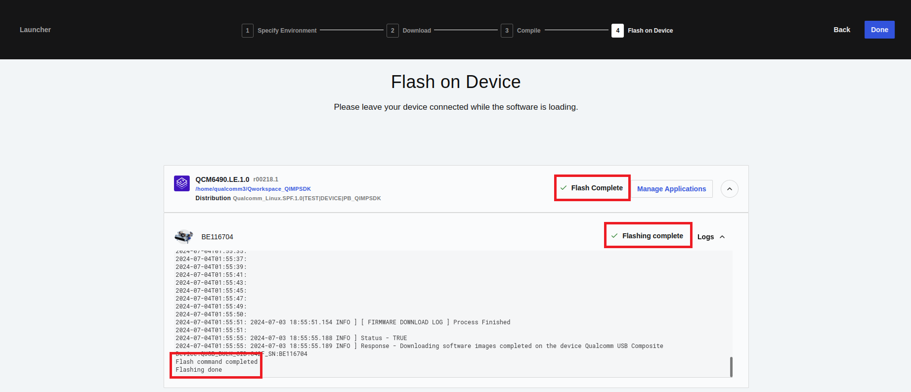

.. _concept_n2t_tjn_w1c:

Use QSC Launcher
================

**Note:** A one-time login is required into
`chipcode.qti.qualcomm.com <http://chipcode.qti.qualcomm.com/>`__ to
download Qualcomm proprietary git repositories. Use your Qualcomm login
credentials to complete this step.

1. To open the QSC desktop application, either launch **Qualcomm
   Software Center** from the **Applications** menu or run the following
   command from the Linux terminal:

   ::

      /opt/qcom/softwarecenter/bin/softwarecenter

   **Note:** For the Launcher workflow to detect connected devices and
   flash software builds, ensure that the Qualcomm Product Configuration
   Assistant Tool (PCAT) and Qualcomm USB Driver (QUD) are installed on
   the host machine. Click **PCAT** to install PCAT and **QUD** to
   install QUD as shown in the following image:

   |image1|

   **Or**

   Install PCAT and QUD using ``qpm-cli``:

   ::

      qpm-cli --login
      qpm-cli --install pcat --activate-default-license
      qpm-cli --install qud --activate-default-license

   The ``qpm-cli --help`` command lists the help options.

   For Ubuntu 22.04, you may encounter an issue while installing QUD
   where you are asked to enroll the public key on your Linux host for a
   successful QUD installation. For more details, follow the steps
   provided in the ``signReadme.txt`` file available at the
   ``/opt/QUIC/sign/`` directory.

2. Use your Qualcomm ID to log in to the QSC desktop application. A
   dashboard page appears as shown in the following figure:

   |image2|

   -  If you do not have a connected device, click **Start Launcher** on
      the top panel to start the steps to configure, download, compile,
      and flash Qualcomm Linux to your device.
   -  If you have a connected device, click **Start Launcher** for the
      appropriate device in the **Connected devices** panel to download,
      compile, and flash Qualcomm Linux to your connected device.

3. On the **Specify Environment** page, select the following values
   based on the build:

   -  Category: **IoT**
   -  Chipset: **QCM6490**
   -  Host OS: **Linux**
   -  Target OS: **LE** **Note:** See `Release
      Notes <https://docs.qualcomm.com/bundle/publicresource/topics/RNO-240626095531/>`__
      for all the supported chipsets.

   |image3|

4. Click **Next**. The **Select Resources** page appears.

5. On the **Select Resources** page, perform the following steps:

   |image4|

   1. In the **Base Workspace Path** text box, specify a directory path
      where you want to download the software. You can click the select
      icon to display the directory selection window.

   2. Select product ID (For chipset QCM6490 and target OS LE,
      **QCM6490.LE.1.0** is the product ID).

   3. Select release ID (See the latest `Release
      Notes <https://docs.qualcomm.com/bundle/publicresource/topics/RNO-240626095531/>`__.
      For example, **r00218.1**).

   4. Select the appropriate distribution to download. Distribution
      access is controlled by access levels as listed in the following
      table:

      **Note:** For more details on the available distributions, see the
      **Access Controlled Distribution** table in the `Release
      Notes <https://docs.qualcomm.com/bundle/publicresource/topics/RNO-240626095531/>`__.

      +-------------------------+-------------------------+------------------+
      | **Access level**        | **Distribution**        | Yocto layers     |
      +=========================+=========================+==================+
      | Public developer        | Base build: High-level  |                  |
      | (unregistered)          | operating system (OS)   |                  |
      |                         | and prebuilt firmware   |                  |
      |                         | (GPS                    |                  |
      |                         | only)\                  |                  |
      |                         |  ``Qualcomm_Linux.SPF.1 |                  |
      |                         | .0|TEST|DEVICE|PUBLIC`` |                  |
      +-------------------------+-------------------------+------------------+

\|\ ``meta-qcom``

``meta-qcom-hwe``

| 

::

       |Base build + Qualcomm Intelligent Multimedia Product \(QIMP\) SDK`Qualcomm_Linux.SPF.1.0|TEST|DEVICE|PB_QIMPSDK`

\|\ ``meta-qcom``

``meta-qcom-hwe``

``meta-qcom-qim-product-sdk``

| 

::

       |Base build + QIMP SDK + Qualcomm Intelligent Robotics Product \(QIRP\) SDK`Qualcomm_Linux.SPF.1.0|TEST|DEVICE|RoboApiLnx`

\|\ ``meta-qcom``

``meta-qcom-hwe``

``meta-ros``

``meta-qcom-robotics``

``meta-qcom-robotics-distro``

``meta-qcom-robotics-sdk``

``meta-qcom-qim-product-sdk``

| 

::

       |Registered developer from a verified organization|Base build: High-level OS and firmware source \(GPS only\)`Qualcomm_Linux.SPF.1.0|AP|Standard|OEM|NoModem`

\|\ ``meta-qcom``

``meta-qcom-hwe``

``meta-qcom-extras``

| 

::

       |Base build + QIMP SDK`Qualcomm_Linux.SPF.1.0|AP|Standard|OEM|NM_QIMPSDK`

\|\ ``meta-qcom``

``meta-qcom-hwe``

``meta-qcom-extras``

``meta-qcom-qim-product-sdk``

| 

::

       |Base build + QIMP SDK + QIRP SDK`Qualcomm_Linux.SPF.1.0|AP|Standard|OEM|NM_QIRPSDK`

\|\ ``meta-qcom``

``meta-qcom-hwe``

``meta-qcom-extras``

``meta-qcom-robotics-extras``

``meta-ros``

``meta-qcom-robotics``

``meta-qcom-robotics-distro``

``meta-qcom-robotics-sdk``

``meta-qcom-qim-product-sdk``

| 

::

       |Licensed developer with additional access|Base build: High-level OS and firmware \(GPS only\) source`Qualcomm_Linux.SPF.1.0|AP|Standard|OEM|`

\|\ ``meta-qcom``

``meta-qcom-hwe``

``meta-qcom-extras``

| 

::

       |Base build + QIMP SDK \(GPS only\)`Qualcomm_Linux.SPF.1.0|AP|Standard|OEM|QIMPSDK`

\|\ ``meta-qcom``

``meta-qcom-hwe``

``meta-qcom-extras``

``meta-qcom-qim-product-sdk``

| 

::

       |Base build: High-level OS and firmware \(GPS and modem\) source`Qualcomm_Linux.SPF.1.0|AMSS|Standard|OEM|`

\|\ ``meta-qcom``

``meta-qcom-hwe``

``meta-qcom-extras``

| 

::

       |Base build + QIMP SDK \(GPS and modem\)`Qualcomm_Linux.SPF.1.0|AMSS|Standard|OEM|QIMPSDK`

\|\ ``meta-qcom``

``meta-qcom-hwe``

``meta-qcom-extras``

``meta-qcom-qim-product-sdk``

| 

::

       The Qualcomm Linux Yocto layers are described in the following table:

       |Yocto layer|Description|
       |-----------|-----------|
       |`meta-qcom`|Contains Qualcomm hardware support metadata with upstream OSS software components.|
       |`meta-qcom-hwe`|Contains Qualcomm hardware support metadata with board support package \(BSP\) software components.|
       |`meta-qcom-extras`|Enables source compilation of select components, which are otherwise present as binary in `meta-qcom-hwe`. This layer is an optional metadata layer for registered users.|
       |`meta-qcom-qim-product-sdk`|Provides Qualcomm's multimedia and AI SDKs based GStreamer framework. It includes a set of GStreamer plugin sample applications for multimedia and AI use cases.|
       |`meta-ros`|Contains a series of OpenEmbedded layers to add support for the Robot Operating System \(ROS\) for embedded Linux releases by the Yocto Project.|
       |`meta-qcom-robotics-distro`|Contains the configuration information needed to generate the ROS image, including the package group and image recipe.|
       |`meta-qcom-robotics`|Contains the robotics recipes and the mechanism to generate Robotics SDK.|
       |`meta-qcom-robotics-extras`|Contains the proprietary robotics recipes that are built with source.|
       |`meta-qcom-robotics-sdk`|Contains the generation mechanism \(package of cross-compile toolchain, script, and function SDK\) and pick-up mechanism \(necessary files from QIMP SDK, QNN SDK, and QIRF SDK through `config.json`\) of Robotics Product SDK.|

6.  Click **Download** to download the selected software:

    |image5|

    The **Download** page displays the download progress. Download
    progress is also available in the top menu bar **Downloads** option
    in the Chip Software section.

7.  To start compilation after the download completes, select
    **Compile** (depending on the size of the downloaded software and
    host machine configuration, compilation may take a few hours):

    |image6|

8.  To view the compilation progress of individual software images,
    expand the logs panel as shown in the following figure:

    |image7|

    On a successful build of the ``qcom-wayland`` distributions, you can
    see the images at the following path:

    ::

       # system.img is present at the following path
       <Base_Workspace_Path>/DEV/LE.QCLINUX.1.0.r1/build-qcom-wayland/tmp-glibc/deploy/images/qcm6490/qcom-multimedia-image/*

    On a successful build of the ``qcom-robotics-ros2-humble`` (QIRP)
    distribution, you can see the QIRP SDK build artifacts at the
    following paths:

    ::

       QIRP SDK artifacts: <Base_Workspace_Path>/DEV/LE.QCROBOTICS.1.0.r1/build-qcom-robotics-ros2-humble/tmp-glibc/deploy/qirpsdk_artifacts/qirp-sdk_<version>.tar.gz
       # system.img is present at the following path
       Robotics image: <Base_Workspace_Path>/DEV/LE.QCROBOTICS.1.0.r1/build-qcom-robotics-ros2-humble/tmp-glibc/deploy/images/qcm6490/qcom-robotics-full-image/*

    **Note:** ``<Base_Workspace_Path>`` is the path that you select on
    the Select Resources page.

    **Note:** BitBake fetch errors are typically intermittent fetch
    failures. Retry `step 7 <#step_7>`__ to work around these
    intermittent errors. If the issue persists, see `BitBake Fetcher
    Error <troubleshoot_sync_build_and_flash.rst#do_fetch_error>`__ for a
    solution.

9.  To incorporate changes made after the compilation step is complete,
    click **Retry** to recompile:

    |image8|

10. Click **Next** to flash software to the device.

.. _section_cmp_qbj_x1c:

Flash
-----

**Note:** Ensure that the device is in Emergency Download (EDL) mode
before you flash the software. For more information on how to force the
device into EDL mode, see `Move to EDL
mode <flash_images_unregistered.rst#section_vgg_mly_v1c>`__.

To flash software to the device with Launcher, perform the following
steps:

1. With the device connected and in EDL mode, select the device on which
   you want to flash the software as shown in the following figure:

   |image9|

2. Click **Flash on device**. The page updates and displays a progress
   bar as Launcher begins flashing the software. Leave the device
   connected while the software is being flashed.

3. To view logs, expand the logs panel as shown in the following figure:

   |image10|

4. When the process is finished, *Flash Complete* and similar messages
   are displayed on the page:

   |image11|

5. Click **Done**. To connect to the device, see `How to
   SSH <howto_setup.rst#section_hmw_vsh_p1c_vinayjk_03-01-24-1110-45-279>`__.

.. |image7| image:: ../../media/k2c-qli-build-ga/qsc_compile_progress.png
.. |image8| image:: ../../media/k2c-qli-build-ga/qsc_compile_complete.png

