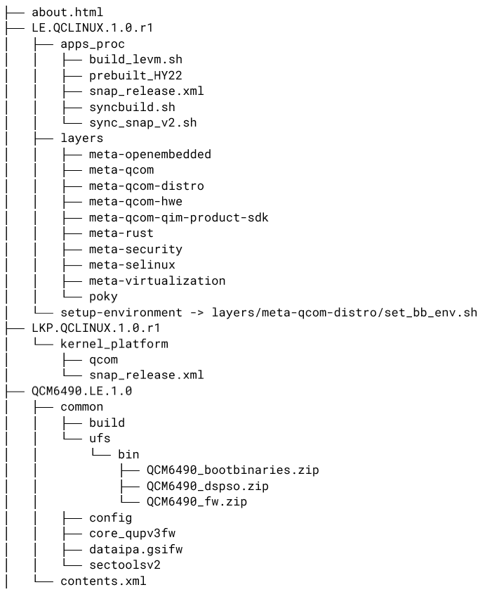
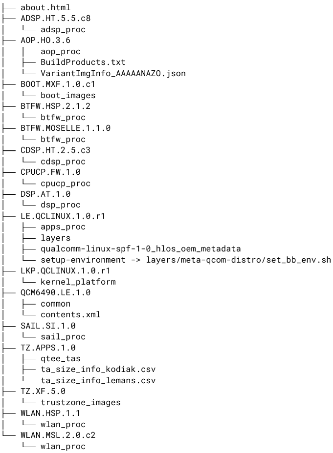
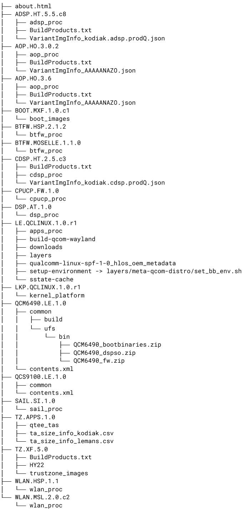
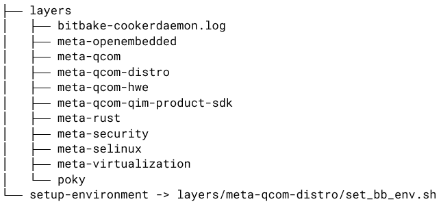
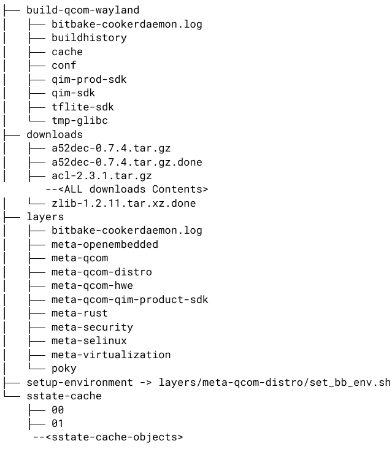
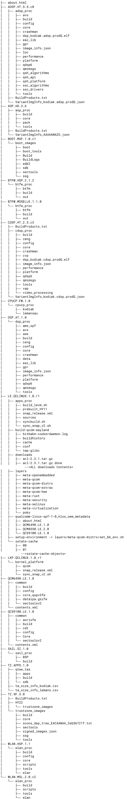

.. _troubleshoot_howto_annex:

Workspace view
==============

This section provides sample workspace structures with ``qsc-cli`` and
GitHub workflow standalone use cases for QCS6490 and QCS5430.

.. _section_bsj_xhm_q1c_vinayjk_03-05-24-1606-7-713:

Workspace structure with qsc-cli
--------------------------------

-  Directory structure before the
   ``Qualcomm_Linux.SPF.1.0|TEST|DEVICE|PB_QIMPSDK`` distribution build
   is shown in the following figure (``LE.QCLINUX.1.0.r1`` contains the
   Yocto workspace):

   |image1|

-  Directory structure after
   ``Qualcomm_Linux.SPF.1.0|TEST|DEVICE|PB_QIMPSDK`` distribution build
   is shown in the following figure:

   |image2|

-  Directory structure before
   ``Qualcomm_Linux.SPF.1.0|AP|Standard|OEM|NoModem`` distribution build
   with firmware and extras is shown in the following figure:

   |image3|

-  Directory structure after
   ``Qualcomm_Linux.SPF.1.0|AP|Standard|OEM|NoModem`` distribution build
   with firmware and extras is shown in the following figure:

   |image4|

.. _section_ibb_xkc_t1c_vinayjk_03-15-24-054-26-366:

Workspace structure with GitHub workflow standalone instructions
----------------------------------------------------------------

-  Directory structure before GitHub workflow QIMP SDK standalone build
   is shown in the following figure:

   |image5|

-  Directory structure after GitHub workflow QIMP SDK standalone build
   is shown in the following figure:

   |image6|

-  Directory structure after building firmware of
   ``qualcomm-linux-spf-1-0_ap_standard_oem_nomodem`` is shown in the
   following figure:

   **Note:**

   -  ``qualcomm-linux-spf-1-0_ap_standard_oem_nomodem`` contains the
      downloaded select firmware sources.
   -  ``LE.QCLINUX.1.0.r1`` contains the built Yocto workspace. |image7|

-  Directory structure after building firmware of
   ``qualcomm-linux-spf-1-0_amss_standard_oem_nomodem`` is shown in the
   following figure:

   **Note:**

   -  ``qualcomm-linux-spf-1-0_amss_standard_oem_nomodem`` contains the
      downloaded select firmware sources.
   -  ``LE.QCLINUX.1.0.r1`` contains the built Yocto workspace. |image8|

.. _section_pg4_nzt_vbc_vinayjk_06-25-24-1332-59-291:

Images directory structure after successful build
-------------------------------------------------

-  Images directory after a successful build is shown in the following
   figure:

   |image9|

   The images directory files are described in the following table:

   +-----------------------------+----------------------------------------+
   | Filename                    | Description                            |
   +=============================+========================================+
   | ``.mbn`` and ``*.elf``      | Boot critical images                   |
   +-----------------------------+----------------------------------------+
   | ``gpt_main*.bin``           | GUID partition table binaries for the  |
   |                             | primary partition table                |
   +-----------------------------+----------------------------------------+
   | ``gpt_backup*.bin``         | GUID partition table binaries for the  |
   |                             | secondary partition table              |
   +-----------------------------+----------------------------------------+
   | ``system.img``              | Rootfs image                           |
   +-----------------------------+----------------------------------------+
   | ``rawprogram*.xml``         | Image ``lun`` and start sector ``lba`` |
   |                             | values                                 |
   +-----------------------------+----------------------------------------+
   | ``efi.bin``                 | EFI system partition image. For more   |
   |                             | information, see `Qualcomm Linux Yocto |
   |                             | Guide <ht                              |
   |                             | tps://docs.qualcomm.com/bundle/publicr |
   |                             | esource/topics/80-70014-27/platform_so |
   |                             | ftware_features.html#partitioning>`__. |
   +-----------------------------+----------------------------------------+
   | ``qdl``                     | Flashing tool binary                   |
   +-----------------------------+----------------------------------------+
   | ``dtb.bin``                 | Binary image that bundles all DTB      |
   |                             | binaries generated during build        |
   +-----------------------------+----------------------------------------+
   | ``vmlinux``                 | Compile kernel ``elf`` binary          |
   +-----------------------------+----------------------------------------+
   | ``Image``                   | Linux kernel ARM64 boot executable     |
   |                             | image                                  |
   +-----------------------------+----------------------------------------+

**Parent
topic:**\ `References <../../topic/k2c-qli-build-ga/references.rst>`__

.. |image2| image:: ../../media/k2c-qli-build-ga/ws_qsc_cli_2.png

.. |image8| image:: ../../media/k2c-qli-build-ga/ws_standalone_4.png
.. |image9| image:: ../../media/k2c-qli-build-ga/ws_standalone_5.png
